# Bespoke Atelier & Pattern Concierge

**A Multimodal, Neuro-Symbolic Agent Engine for Bespoke Pattern Drafting & Textile Simulation**


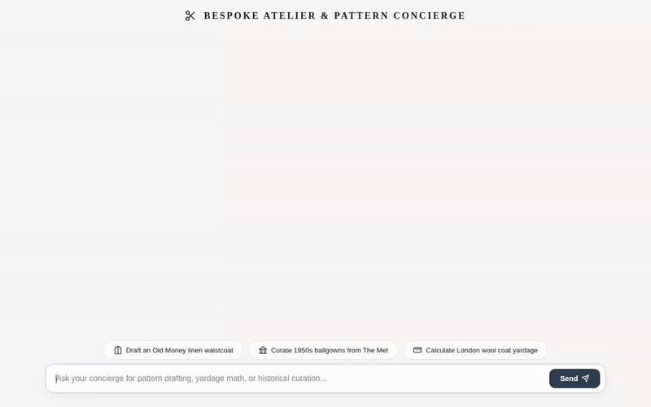

---

## 📐 Overview

**Bespoke Atelier & Pattern Concierge** is an AI agent built on the **Google Agent Development Kit (ADK)** and **Gemini 2.5 Flash**. It combines deterministic Python execution with generative AI models to deliver custom sewing pattern drafting, technical fashion flat drawings, 360° fabric drape video previews, and real-time climate-informed fabric advice.

By bridging generative multimodal intelligence with a neuro-symbolic Python code execution sandbox, the agent computes exact ease allowances, dart intake trigonometry, circle skirt arc radii, and fabric yardage requirements, rendering interactive **A2UI v0.8** specification cards directly in the web frontend.

---

## 🖥️ Live UI Interface & Functionalities

Here is a visual walkthrough of the live Bespoke Atelier web application interface covering its core functionalities:

| Feature / Interface State | Visual Proof | Description |
| ------------------------- | ------------ | ----------- |
| **Atelier Concierge Landing UI** | 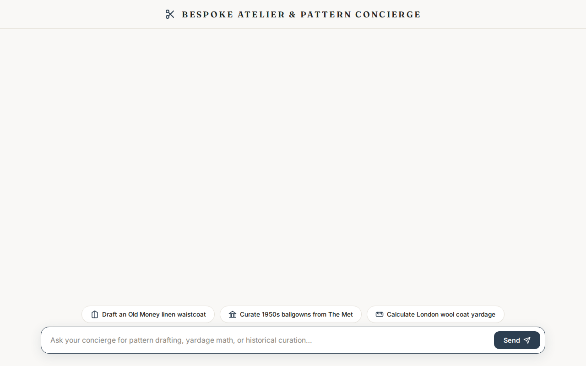 | Elegant editorial interface featuring quick action prompt chips, hand-drawn needle indicators, and floating query bar. |
| **A2UI Pattern Cards & Catalog** | 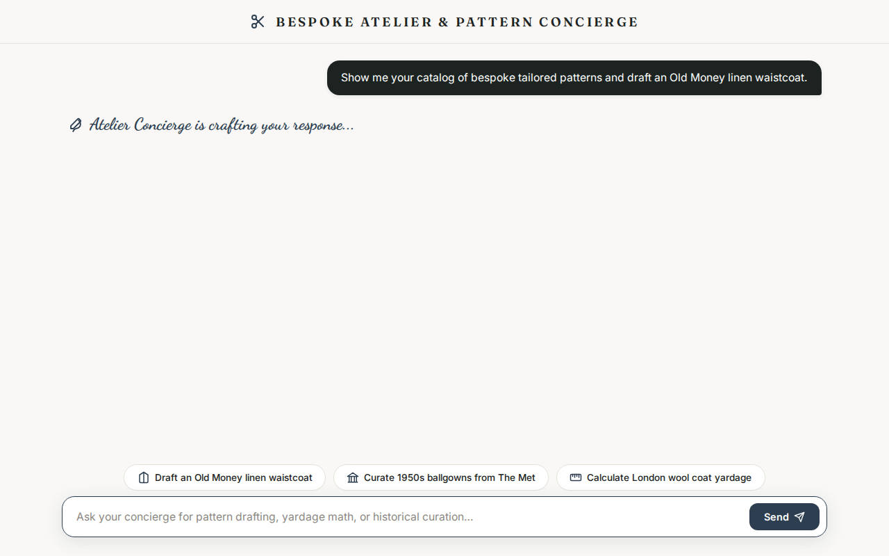 | Dynamic A2UI v0.8 surface rendering sewing pattern templates (*Old Money Waistcoat*, *Circle Skirt*, *Milkmaid Dress*, *Wide-Leg Trousers*). |
| **2D Technical Sketch & Cut List Table** | 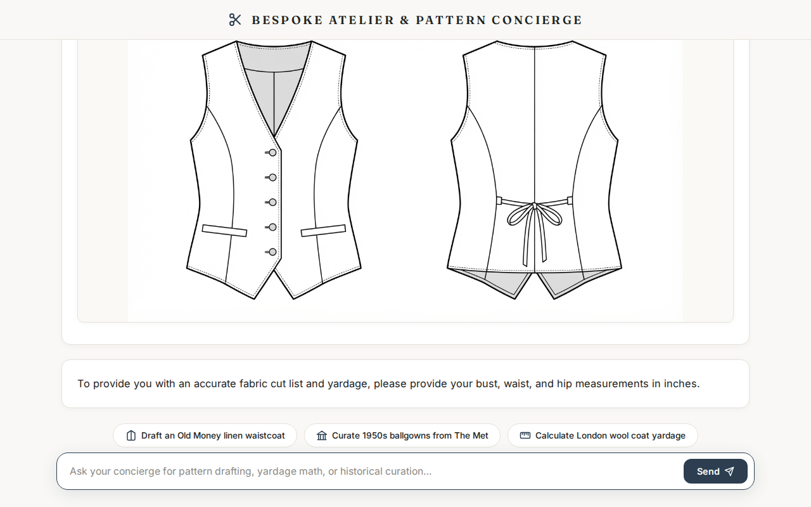 | Real-time CAD flat sketch generation alongside fabric yardage matrix tables across 45" and 60" bolt widths. |

---

## 🏛️ System Architecture

The application runs on Google Cloud using **Vertex AI Agent Engine**, **Cloud Run**, **Firestore**, **Cloud Storage**, and **Vertex AI Memory Bank**.

### High-Level Architecture Diagram

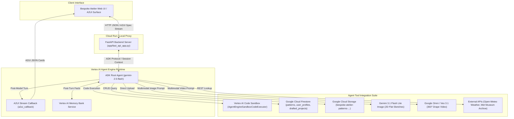

### Sequence Flow Diagram

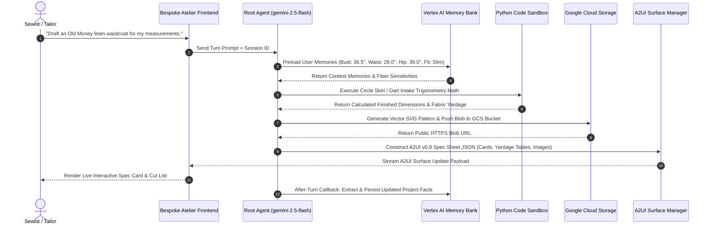

---

## ✨ Core Features & Visual Proof

### 1. Deterministic CAD Drafting Sandbox

Calculates precise parametric pattern drafting ease, dart intake trigonometry, and cutting yardage optimizations across 45" and 60" fabric bolt widths.

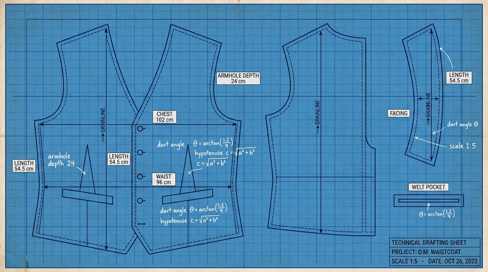

* **Implementation**: `calculate_pattern_requirements` & `AgentEngineSandboxCodeExecutor` in [`app/tools.py`](file:///config/.gemini/antigravity/scratch/bespoke-atelier/app/tools.py#L318-L444)
* **Mathematical Precision**: Eliminates LLM arithmetic hallucination by delegating circle skirt radius math \(r = \frac{\text{waist} + \text{ease}}{2\pi}\) and dart intake angles directly to a secure Python sandbox.

---

### 2. 2D Technical Flat Generation

Generates clean, production-ready 2D technical fashion flat sketches (front and back CAD tech pack views) complete with topstitching, seams, and pocket placements.

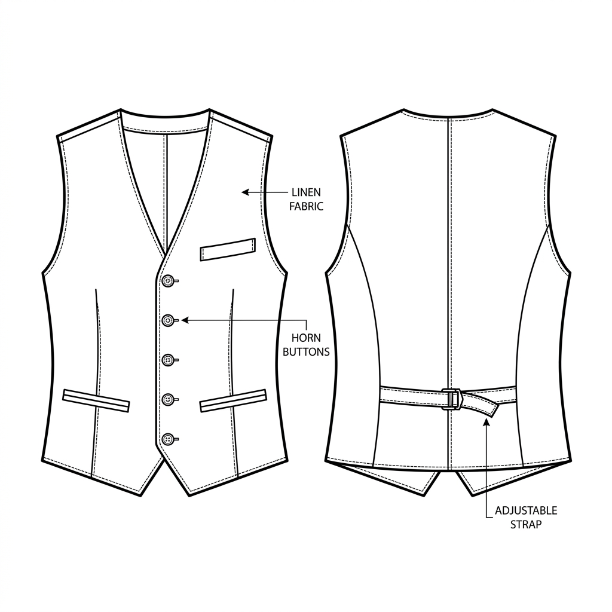

* **Implementation**: `generate_fashion_flat_sketch` in [`app/tools.py`](file:///config/.gemini/antigravity/scratch/bespoke-atelier/app/tools.py#L695-L787)
* **Model**: **Gemini 3.1 Flash Lite Image** on Vertex AI (`location="global"`).

---

### 3. Omni 360° Fabric Drape Video

Renders photorealistic 360-degree turntable studio videos displaying garments on tailor dress form mannequins to preview textile drape and silhouette balance.

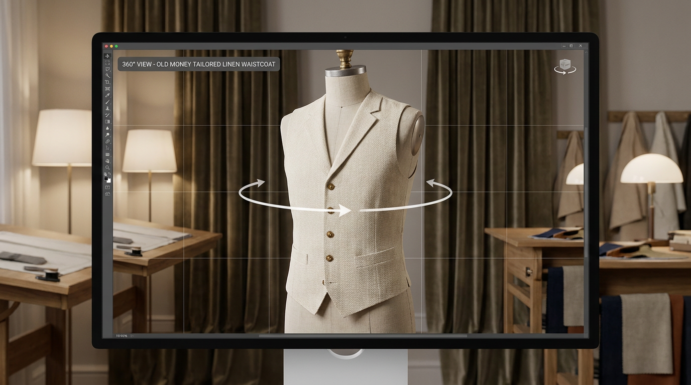

* **Implementation**: `generate_garment_motion_preview` in [`app/tools.py`](file:///config/.gemini/antigravity/scratch/bespoke-atelier/app/tools.py#L791-L913)
* **Model**: **`gemini-omni-flash-preview`** / **`veo-3.1-fast-generate-001`** on Vertex AI (`location="global"`).

---

### 4. Cross-Session Memory Bank

Automatically extracts and remembers durable client body measurements (bust, waist, hips, inseam, height), tailoring fit preferences, and fiber sensitivities across sessions.

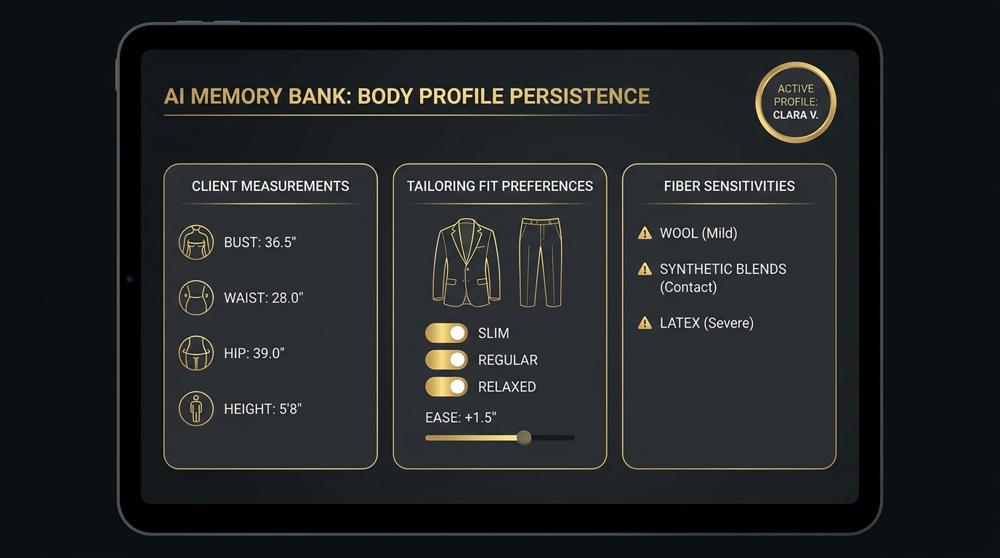

* **Implementation**: `VertexAiMemoryBankService` & `generate_memories_callback` in [`app/agent.py`](file:///config/.gemini/antigravity/scratch/bespoke-atelier/app/agent.py#L67-L85)
* **Persistence**: Automatically injects saved client body profiles into prompt context via `PreloadMemoryTool`.

---

### 5. A2UI Spec Sheets & Fabric Cut Lists

Emits structured **A2UI v0.8 Basic Catalog** JSON components to render interactive spec cards, yardage tables, notion lists, and downloadable vector SVG pattern links.

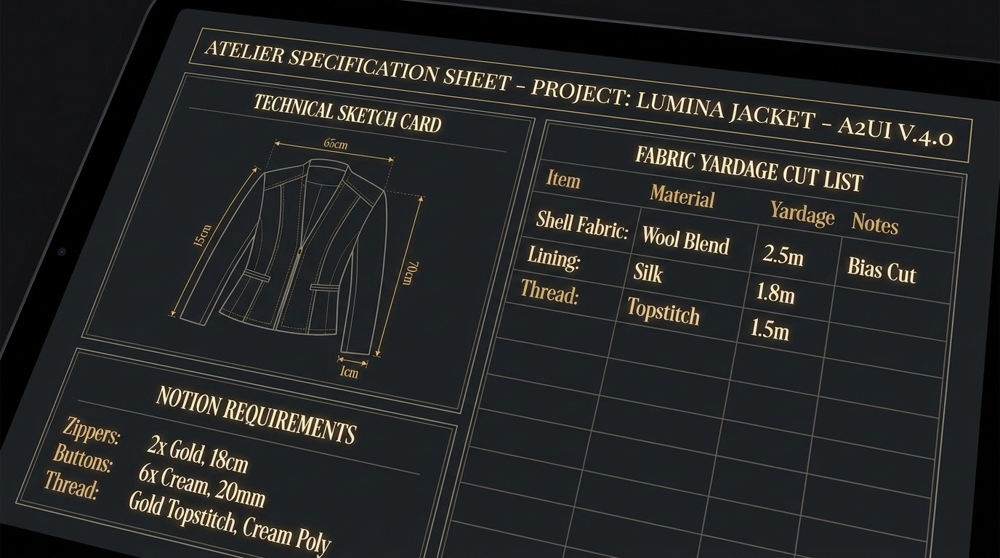

* **Implementation**: `A2uiSchemaManager` & `a2ui_callback` in [`app/a2ui_utils.py`](file:///config/.gemini/antigravity/scratch/bespoke-atelier/app/a2ui_utils.py)
* **Component Pipeline**: Generates clean `beginRendering` surface arrays containing `Card`, `Column`, `Row`, `Text`, and `Image` components.

---

## 🛠️ Technical Implementation & Tools Summary

| Tool Name | Scope & Functionality | Underlying Tech / API |
| --------- | --------------------- | -------------------- |
| `get_patterns_by_aesthetic` | Filter sewing pattern templates by aesthetic style (*Old Money*, *Vintage 1950s*, *Cottagecore*, *Minimalist*) | Firestore (`patterns` collection) + Seed Fallback |
| `get_pattern_by_id` | Fetch full pattern specifications by unique template ID | Firestore (`patterns` document) |
| `save_user_profile` & `get_user_profile` | Save & retrieve user body measurement profiles | Firestore (`user_profiles` collection) |
| `save_drafted_project` & `list_user_projects` | Store & list customized made-to-measure drafted garment projects | Firestore (`drafted_projects` collection) |
| `calculate_pattern_requirements` | Parametric ease math, finished garment dimensions, and yardage matrix | Python Math + Vertex AI Code Sandbox |
| `generate_pattern_svg` | Generate 2D vector SVG pattern files with seam allowances & grainlines | Python SVG Builder + GCS Direct Upload |
| `get_climate_fabric_advice` | Live weather lookup for target cities with fabric GSM & fiber advice | Open-Meteo REST API |
| `search_historic_fashion` | Search historical costume artifacts, materials, & reference imagery | The Metropolitan Museum of Art Archive API |
| `generate_fashion_flat_sketch` | AI-generated 2D CAD technical flat sketches | Gemini 3.1 Flash Lite Image (Vertex AI) |
| `generate_garment_motion_preview` | AI-generated 360° studio turntable video previews | Google Omni (`gemini-omni-flash-preview`) |

---

## ⚡ Production Challenges & Engineering Solutions

### 1. Token Streaming vs. A2UI Structural Integrity
* **Challenge**: Standard LLM token streaming can output malformed JSON chunks mid-stream, breaking front-end JSON parsers expecting valid A2UI array objects.
* **Solution**: Implemented an post-model callback layer (`a2ui_callback` in `app/a2ui_utils.py`) that captures complete model turn outputs, validates the JSON array against `A2uiSchemaManager(version="0.8")`, ensures mandatory `beginRendering` surface headers are present, and wraps responses cleanly for UI hydration.

### 2. Ephemeral Container Filesystem vs. Persistent Media Pipelines
* **Challenge**: Cloud Run and Agent Engine containers use ephemeral disk storage, causing generated SVG patterns, PNG flat sketches, and MP4 videos to vanish upon instance restart.
* **Solution**: Engineered a direct byte-stream pipeline (`upload_from_string`) using `google.cloud.storage`. Media assets generated in memory are pushed immediately to a Google Cloud Storage bucket (`bespoke-atelier-patterns-...`), returning durable public HTTPS URLs embedded in A2UI card payloads.

### 3. Unstructured Memory Bank vs. Relational Firestore State
* **Challenge**: Blending unstructured semantic memories (e.g., *"client prefers relaxed linen fit and has wool sensitivity"*) with structured database entities (e.g., specific pattern IDs and precise body inch values).
* **Solution**: Decoupled state management into two tiers:
  1. **Vertex AI Memory Bank**: Handles unstructured client preferences and historical session facts via automatic `after_agent_callback`.
  2. **Google Cloud Firestore**: Stores structured relational schemas (`user_profiles`, `patterns`, `drafted_projects`), backed by local in-memory fallback dictionaries for offline dev resilience.

---

## 🔍 Observability & Telemetry

The application includes built-in observability using **Cloud Trace**, **Cloud Logging**, and **BigQuery Agent Analytics**:

- **Tool Execution Waterfall**: Traces step-by-step latency for external REST calls (Open-Meteo, Met Museum API), Vertex AI Code Sandbox execution, and image/video model turn durations.
- **Latency Insights**:
  - Parametric Math & Tool Evaluation: ~200ms – 400ms
  - 2D Flat Sketch (`gemini-3.1-flash-lite-image`): ~3s – 5s
  - 360° Drape Video (`gemini-omni-flash-preview`): ~15s – 25s
- **Telemetry Export**: Configured via `google.adk` tracing providers to automatically export token counts, tool invocation inputs/outputs, and error tracebacks to GCP Cloud Trace.

---

## 🚀 Local Setup & Execution Guide

Follow these steps to run the Bespoke Atelier concierge on your local machine.

### Prerequisites

1. **Python 3.11+** installed.
2. **uv** package manager installed (`pip install uv` or see [uv docs](https://docs.astral.sh/uv/)).
3. **Google Cloud SDK (`gcloud`)** configured and authenticated.

### 1. Clone & Install Dependencies

```bash
git clone https://github.com/esther-ethel/buildwithgemini-bespoke-atelier.git
cd buildwithgemini-bespoke-atelier
uv sync
```

### 2. Authenticate Google Cloud ADC

Ensure your Application Default Credentials (ADC) are configured for your GCP project:

```bash
gcloud auth application-default login
gcloud config set project <YOUR_GCP_PROJECT_ID>
```

### 3. Environment Configuration

Copy the example environment file:

```bash
cp .env.example .env
```

Ensure `.env` contains your project settings:

```env
GOOGLE_CLOUD_PROJECT=<YOUR_GCP_PROJECT_ID>
LOCATION=us-east1
GCS_BUCKET_NAME=bespoke-atelier-patterns-<YOUR_GCP_PROJECT_ID>
```

### 4. Seed Firestore Database (Optional)

Populate your Firestore instance with initial sewing pattern templates:

```bash
uv run python seed_firestore.py
```

### 5. Launch Local Application

Start the local server environment:

```bash
export AGENT_ENGINE_RESOURCE_NAME="projects/<YOUR_PROJECT_ID>/locations/us-east1/reasoningEngines/<ENGINE_ID>"
export AGENT_DIRECTORY="app"
uv run python frontend/main.py
```

Once running, open your browser to `http://localhost:8080` (or your configured local port) to interact with the concierge.

---

## 📄 License

Licensed under the [Apache License, Version 2.0](LICENSE).
